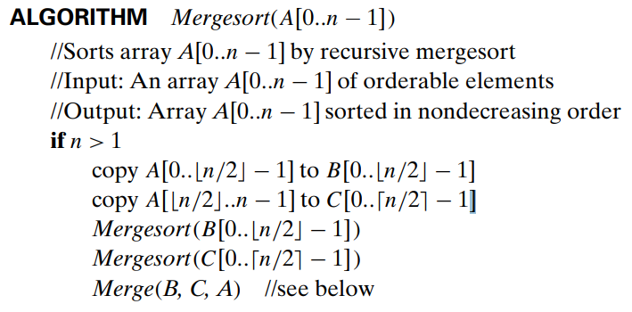
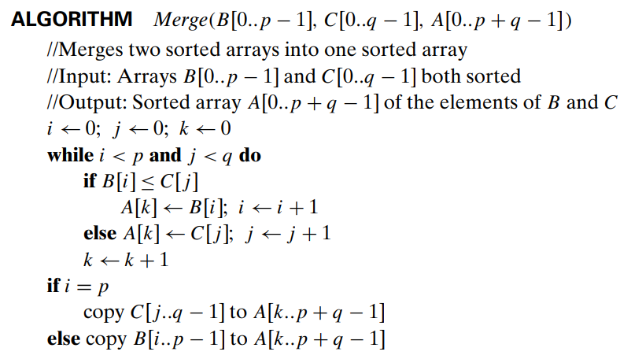
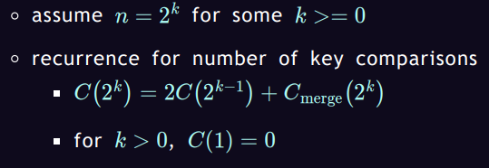

***THIS IS A DRAFT***

Mergesort is a sorting algorithm that uses the algorithm design of divide-and-conquer to sort elements in an array. According to Levitin (2012), divide-and-conquer algorithms generally follow three steps:
1. Divide the problem into several similar sized subproblems.
2. Solve the subproblems recursively (non-recursive algorithms also possible here)
3. Combine subproblems for final solution (if necessary).

Our assignment is to implement the in-place merge function and extra memory merge function for Mergesort. Mergesort follows the three steps of the divide-and-conquer algorithm (Levitin, 2012):
1. We split the array into halves until each subarray contains a single element.
2. Merge the subarrays either using temporary arrays or using the original array in-place.
3. Copy the merged arrays back into the original array. If doing in-place, no need to copy since it's done in place.

We'll first show the pseudocode as defined by Levitin (2012), for both Mergesort and the pseudocode for merge:

Mergesort function pseudocode from Levitin (2012):



Merge function pseudocode from Levitin (2012):



Using both the pseudocode and extra memory implement by baeldung (2024):
```java
public static void mergeSort(int[] a, int n) {
    // If the array has less than 2 elements, it's already sorted
    if (n < 2) {
        return;
    }
    // Find the middle point to divide the array into two halves
    int mid = n / 2;
    // Create temporary arrays to hold the two halves
    int[] l = new int[mid];
    int[] r = new int[n - mid];

    // Copy data to the left subarray
    for (int i = 0; i < mid; i++) {
        l[i] = a[i];
    }
    // Copy data to the right subarray
    for (int i = mid; i < n; i++) {
        r[i - mid] = a[i];
    }
    // Recursively sort the left subarray
    mergeSort(l, mid);
    // Recursively sort the right subarray
    mergeSort(r, n - mid);

    // Merge the sorted subarrays
    merge(a, l, r, mid, n - mid);
}

public static void merge(
  int[] a, int[] l, int[] r, int left, int right) {
    int i = 0, j = 0, k = 0;
    // Traverse both arrays and copy the smallest element to a
    while (i < left && j < right) {
        if (l[i] <= r[j]) {
            a[k++] = l[i++];
        } else {
            a[k++] = r[j++];
        }
    }
    // Copy any remaining elements of l[] to a[]
    while (i < left) {
        a[k++] = l[i++];
    }
    // Copy any remaining elements of r[] to a[]
    while (j < right) {
        a[k++] = r[j++];
    }
}


```

Dadhaniya (2024) describes an efficient approach to in-place Mergesort using a similar algorithm to insertion sort. However, instead of just comparing adjacent elements like in insertion sort, we compare elements at different intervals to find the correct position of every element. We start with a large interval h and sort elements h distance apart. We then decrease h and repeat the process of sorting elements until h is reduced to 1.
```java
    public static void mergeSort(int[] arr, int start, int end) {
        if (start >= end) {
            return;
        }
        int mid = (start + end) / 2;

        mergeSort(arr, start, mid);
        mergeSort(arr, mid + 1, end);
        
        inPlaceMerge(arr, start, mid, end);
    }

    public static void inPlaceMerge(int[] arr, int start, int mid, int end) {
        // Calculate the initial gap (h) for comparisons
        int len = end - start + 1;
        int h = (int) Math.ceil(len / 2.0);
        // Perform comparisons and swaps based on the gap
        while (h >= 1) {
            int i = start;
            while (i + h <= end) {
                if (arr[i] > arr[i + h]) {
                    // Swap elements if they are out of order
                    int temp = arr[i];
                    arr[i] = arr[i + h];
                    arr[i + h] = temp;
                }
                i++;
            }
            // If the gap is 1, break to prevent infinite loop
            if (h == 1) {
                break;
            }
            // Reduce the gap for the next iteration
            h = (int) Math.ceil(h / 2.0);
        }
    }
```


Analysis Framework

Extra memory Mergesort:
As discussed in the COMP-359 "Ch 5: Divide-and_Conquer" slides (Campbell, 2024), Mergesort can be expressed as a recurence relation:



When solved, the time complexity comes to O(n logn).

Since we create temporary arrays on every recursive call, the space complexity of mergesort is O(n) (baeldung, 2024).


In-place Mergesort:
Dadhaniya (2024) uses a merging technique where you merge two sorted subarrays within the original array without using extra space, by comparing and swapping elements.

Since the in-place doesn't use any temporary arrays, the additional space complexity is O(1) (Dadhaniya, 2024). 

For the time complexity, the in-place Mergesort is calculated as follows (Dadhaniya, 2024):
Since we iterate through the whole array with decreasing values of h, we start with h = n / 2
After each step, h is reduced by half.
Stop when h equals 1.
Therefore, (n/2)/2^steps = 1
steps = O(log_2n)
The overall time complexity of the merge function is:
n * steps = n * log_2n = O(n log_2n)

For Mergesort, we have log_2n levels of recursion so the overall time complexity of in-place merge sort:
log_2n * O(n log_2n) = O(n (log_2n)^2)

***TODO: CREATE SEPARATE JAVA FILES CONTAINING THE EXTRA  MEMORY MERGESORT AND THEN IN-PLACE MERGESORT, TESTING FUNCTIONS SHOULD ALSO BE IN A SEPARATE FILE. THE EMPIRCAL ANALYSIS SHOULD ALSO BE IN A SEPARATE FILE. 4 SEPARATE JAVA FILES TOTAL (maybe should I do extra memory and in-place mergesort in the same file? idk)***

***TODO: EMPIRCAL TESTING OF RANDOM ARRAYS OF SIZES [1000, 5000, 10000, 50000, 100000], RUN EACH 5 TIMES AND AVERAGE THEM OUT, MAKE SURE TO SHOW THE CODE FOR THE TESTING, AND PUT IT IN A MARKDOWN TABLE OR TAKE A SCREENSHOT OF EXCEL TABLE, EITHER WORK. THE IN-PLACE MERGESORT WILL PROBABLY TAKE A LITTLE LONGER, NOTE YOUR OBSERVATIONS***

***TODO: WRITE A SHORT PARAGRAPH ABOUT THE TRADEOFFS OF EACH, SPACE VS. TIME***

***TODO (not here): SLIDES FOR PRESENTATION***


References:

Levitin, A. (2012). Introduction to the design & analysis of algorithms. In Pearson Addison Wesley eBooks. https://ci.nii.ac.jp/ncid/BB14217613

Campbell, R. (2024). Ch 5: Divide-and-Conquer. Week 6 Slides.

baeldung. (2024). Merge sort in Java. https://www.baeldung.com/java-merge-sort 

Dadhaniya, D. (2024, April 1). Learn in-place merge sort. https://www.interviewkickstart.com/blogs/learn/in-place-merge-sort 
